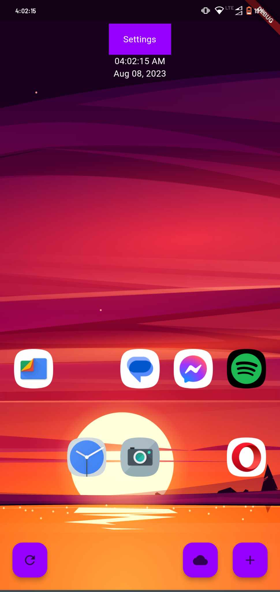
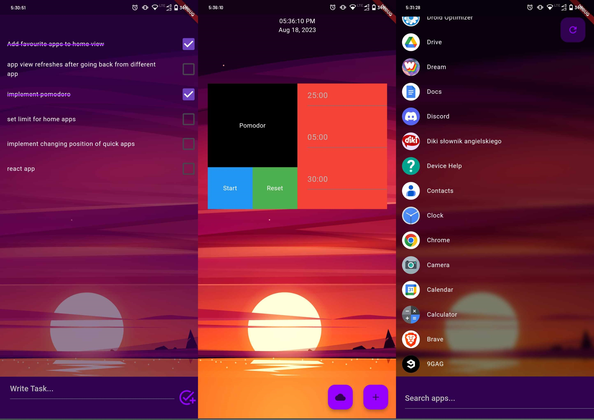
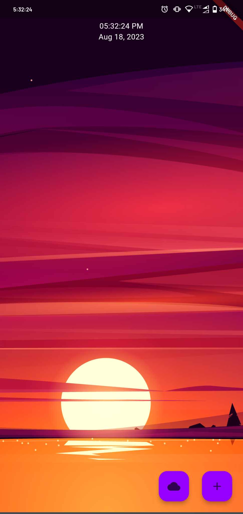

# Android Launcher

Mobile application that replaces the default Android home screen.

---

## 🚀 Features
- Minimalistic main screen with clock, date, quick apps button, and Pomodoro button
- Left screen with user's tasks
- Right screen displaying all installed applications
- Custom application search engine
- Built-in Pomodoro timer
- Local storage for personal data (tasks and preferences)

---

## 🛠️ Tech Stack
- Flutter
- Dart
- Local storage

---

## 🏗️ Architecture Overview
- Application built using Flutter and Dart
- Local state management within the app
- Persistent local storage for user data
- Integration with Android system as a custom launcher

---

## 🧠 Technical Implementation
- Custom launcher integration with Android system
- Custom navigation between launcher screens
- Custom application search functionality
- Task management with persistent storage
- Pomodoro timer implementation

---

## 📸 Screenshots




---

## ⚙️ How to Run the Application
1. Clone repository:
   ```bash
   git clone https://github.com/Qwertiush/Launcher.git
2. Install dependencies:
  ```bash
  flutter pub get
  ```
3. Run application:
  ```bash
  flutter run
  ```

